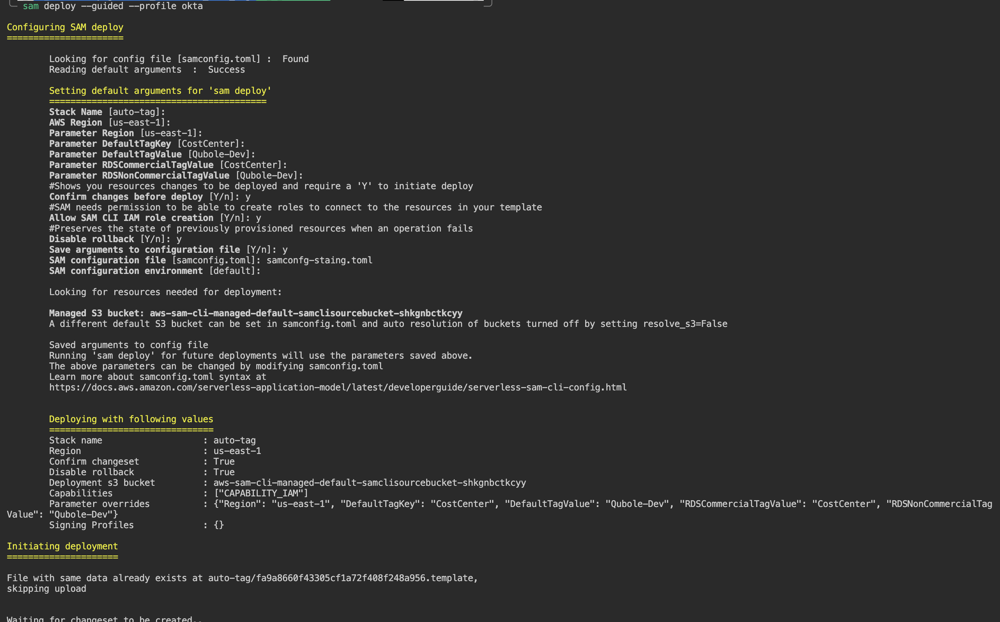

# README

This guide helps you to deploy serverless application with other aws resources to automatically tag when the resources are created.


### Requirements
- AWS CLI
- SAM CLI
- AWS Credentials

### Usage

```
sam deploy --guided --profile okta
```

Load the existence config file

```
sam deploy --guided --profile name-of-profile --config-file file.toml
```

